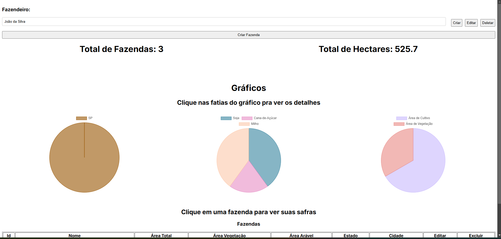

# BrainAgricultureTest

## How to run

```
docker compose -f docker-compose-dev.yml up -d --build
```

## How to access

### The frontend

```
http://localhost:3000
```

### The API Docs

```
http://localhost:8080/docs
```

## How to run the tests

## Backend

```
cd backend
```

```
sudo apt update;sudo apt install python3-virtualenv
```

```
virtualenv venv
```

```
source venv/bin/activate
```

```
pip install -r requirements.txt
```

```
pytest -v
```

## Frontend

Couldn't finish frontend testing, but it's needed to send to production.

## Notes

To scale this project it would be necessary to add pagination to the crops as well, as over time a farmer will have many crops, but it was not possible to do this during the test period.

## Screenshot

